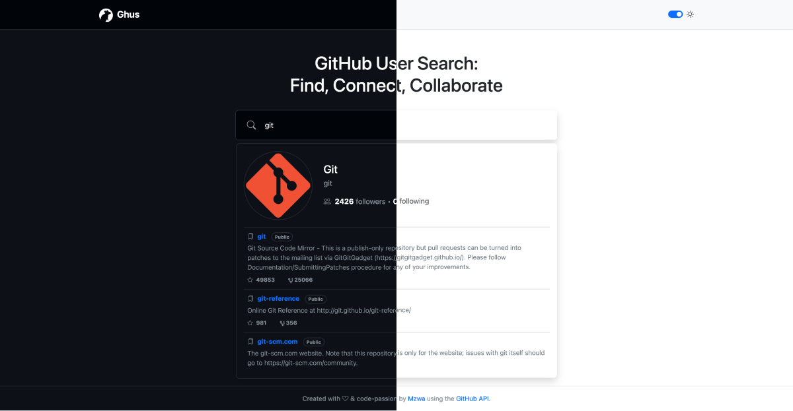

# GitHub User Search (Ghus)

My GitHub User Search project is built entirely with vanilla JavaScript, utilizing the GitHub REST API through Octokit. If you're interested in cloning it, please note that you'll need to obtain your own GitHub token for authentication. Happy coding!

## Table of contents

- [Overview](#overview)
  - [Screenshot](#screenshot)
  - [Links](#links)
- [Tech Stack](#tech-stack)
- [Author](#author)

## Overview

### Screenshot

### Links

- Code URL: [Github Repo.](https://github.com/mzwabantu/ghus)
- Live Site URL: [Eezy Bank](http://ghus.mzwwwa.co.za/)

## Tech stack

- Javascript
- HTML5
- CSS 
- Bootstrap 5

## Author

- Website - [Mzwabantu](https://mzwwwa.co.za/)
- LinkedIn - [mzwabantungubelanga](https://za.linkedin.com/in/mzwabantungubelanga)
- Dribbble - [MzwaN](https://dribbble.com/MzwaN)